<div align="center">
  
</div>

# mcp-sync

> Zero-polling MCP config sync for macOS — keeps all your IDEs' MCP server configs perfectly in sync.  
> Uses Apple's native **FSEvents API** via `fswatch` for instant, battery-friendly file watching.

**Supported IDEs:** Windsurf · VSCode · Cursor · Zed · Claude Code · OpenCode

---

## What it does

```
~/.config/mcp-servers.json             ← canonical (single source of truth)
           │
           │  fswatch (FSEvents, zero-poll, bidirectional)
           │
           ├──► ~/.codeium/windsurf/mcp_config.json       (Windsurf)
           ├──► ~/Library/Application Support/Code/User/mcp.json  (VSCode)
           ├──► ~/.cursor/mcp.json                        (Cursor)
           ├──► ~/.config/zed/settings.json               (Zed)
           ├──► ~/.claude.json                            (Claude Code)
           └──► ~/.config/opencode/opencode.json          (OpenCode)
```

**Bidirectional sync:** Edit your MCP config in _any_ IDE — the change propagates instantly to all others via the canonical file. Each IDE gets its native format automatically:

| IDE | Format |
|-----|--------|
| Windsurf | `{"mcpServers": {...}}` |
| VSCode | `{"servers": {...}}` with `type` field |
| Cursor | `{"mcpServers": {...}}` |
| Zed | `{"context_servers": {...}}` with `source: "custom"` |
| Claude Code | `{"mcpServers": {...}}` merged into existing `~/.claude.json` |
| OpenCode | `{"mcpServers": {...}}` |

---

## Requirements

- macOS (Apple Silicon or Intel)
- [Homebrew](https://brew.sh)
- At least one IDE with MCP support installed

---

## Install

```bash
git clone https://github.com/VrilLabs/mcp-sync.git
cd mcp-sync
chmod +x install.sh && ./install.sh
```

The installer will:
1. `brew install fswatch jq` (if not present)
2. Copy scripts to `~/.config/mcp-sync/scripts/`
3. Install the `mcp` CLI to `~/.local/bin/`
4. Bootstrap `~/.config/mcp-servers.json` from your existing IDE config
5. Register + load the `launchd` agent (auto-starts on login, watches all IDEs)
6. Detect installed IDEs and report status

**That's it — install once, forget forever.** The background agent handles everything automatically.

### Add to PATH (if prompted)

```bash
echo 'export PATH="$HOME/.local/bin:$PATH"' >> ~/.zshrc && source ~/.zshrc
```

---

## Uninstall

```bash
./uninstall.sh
```

---

## CLI Reference (`mcp`)

### Sync & Status

| Command | Description |
|---------|-------------|
| `mcp list` | List all MCP servers from canonical config |
| `mcp status` | Full sync status (agent, fswatch, all IDEs) |
| `mcp sync` | Manually trigger a sync right now |
| `mcp diff` | Compare canonical vs each IDE target |
| `mcp paths` | Print all config file paths |
| `mcp logs` | Tail last 20 lines of sync log |
| `mcp logs -n 50` | Tail last N lines |

### Server Management

| Command | Description |
|---------|-------------|
| `mcp add <name> <cmd> [args]` | Add a server to canonical and sync to all IDEs |
| `mcp remove <name>` | Remove a server from canonical and sync |
| `mcp install <package>` | Install an MCP server from the registry |
| `mcp uninstall <package>` | Uninstall an MCP server package |
| `mcp search [query]` | Search available MCP servers in registry |
| `mcp test <name>` | Test an MCP server (starts it, checks protocol) |

### Diagnostics

| Command | Description |
|---------|-------------|
| `mcp doctor` | Validate all IDE MCP configs |
| `mcp doctor vscode cursor` | Validate specific IDEs |
| `mcp agent start\|stop\|restart\|status` | Control the launchd agent |

---

## Examples

```bash
# List all configured MCP servers
mcp list

# Check everything is working
mcp status

# Validate all IDE configs are correct
mcp doctor

# Validate just Cursor and Zed
mcp doctor cursor zed

# Search the MCP registry for filesystem servers
mcp search filesystem

# Install a server from the registry
mcp install @modelcontextprotocol/server-filesystem

# Add a custom server manually
mcp add my-server npx -- -y @my/mcp-server

# Add with env vars
mcp add github npx -- -y @modelcontextprotocol/server-github -e GITHUB_TOKEN=ghp_xxx

# Test a server responds to MCP protocol
mcp test my-server

# Remove a server
mcp remove old-server

# Force a manual sync
mcp sync

# Restart the background agent
mcp agent restart
```

---

## How Sync Works

1. **fswatch** monitors all IDE config files using macOS FSEvents (zero CPU, no polling)
2. When any file changes, `sync-mcp.sh` fires
3. A **re-entrancy lock** prevents sync loops (writes are ignored for 5s)
4. The changed file updates the **canonical** `~/.config/mcp-servers.json`
5. Canonical is then projected to **all** IDE targets in their native format
6. All writes are **atomic** (temp file + `mv`) — no partial/corrupt configs
7. Files are created with **600 permissions** (owner-only read/write)

---

## MCP Tool Registry

mcp-sync integrates with [mcp-get](https://github.com/michaellatman/mcp-get) to provide a curated registry of MCP servers you can install directly from the CLI:

```bash
# Browse all available servers
mcp search

# Search for specific functionality
mcp search github
mcp search filesystem

# Install a server (auto-syncs to all IDEs)
mcp install @modelcontextprotocol/server-filesystem

# Uninstall
mcp uninstall @modelcontextprotocol/server-filesystem
```

No API keys or authentication required — the registry is fully open and free.

---

## Doctor Command

The `doctor` command validates your MCP configs against each IDE's specific requirements:

```bash
$ mcp doctor
mcp doctor — validating MCP configurations

  windsurf (~/.codeium/windsurf/mcp_config.json)
    ✓ Valid JSON
    ✓ Has 'mcpServers' key
    ✓ filesystem: valid
    ✓ github: valid

  vscode (~/Library/Application Support/Code/User/mcp.json)
    ✓ Valid JSON
    ✓ Has 'servers' key
    ✓ filesystem: valid

  cursor (~/.cursor/mcp.json)
    ✓ Valid JSON
    ✓ Has 'mcpServers' key
    ✓ filesystem: valid

  zed (~/.config/zed/settings.json)
    ✓ Valid JSON
    ✓ Has 'context_servers' key
    ✓ filesystem: valid

✓ All checks passed!
```

Checks performed per IDE:
- Valid JSON syntax
- Correct top-level key (`mcpServers`, `servers`, `context_servers`)
- VSCode: `type` field present (stdio/http)
- Zed: `source` field present
- Server entries have `command` or `url`
- `args` is an array, `env` is an object
- File permissions (recommends 600)

---

## launchd Agent

```bash
# Check agent is running
mcp agent status

# View live log
tail -f ~/.config/mcp-sync/sync.log

# Restart after changes
mcp agent restart
```

---

## File Locations

| File | Purpose |
|------|---------|
| `~/.config/mcp-servers.json` | Canonical single source of truth |
| `~/.codeium/windsurf/mcp_config.json` | Windsurf (watched + synced) |
| `~/Library/Application Support/Code/User/mcp.json` | VSCode (watched + synced) |
| `~/.cursor/mcp.json` | Cursor (watched + synced) |
| `~/.config/zed/settings.json` | Zed (watched + synced) |
| `~/.claude.json` | Claude Code (watched + synced) |
| `~/.config/opencode/opencode.json` | OpenCode (watched + synced) |
| `~/.config/mcp-sync/scripts/sync-mcp.sh` | Core sync script |
| `~/.config/mcp-sync/sync.log` | Sync activity log |
| `~/.config/mcp-sync/sync.err` | Error log |
| `~/Library/LaunchAgents/com.user.mcp-sync.plist` | launchd agent |
| `~/.local/bin/mcp` | CLI helper |

---

## Security

- All config files written with **600 permissions** (owner read/write only)
- Atomic writes prevent corruption from partial writes or race conditions
- Re-entrancy lock prevents infinite sync loops
- Sensitive env vars (`*KEY*`, `*TOKEN*`, `*SECRET*`) are masked in `mcp list` output
- No network calls — everything runs locally

---

## Troubleshooting

```bash
# Full status check
mcp status

# Validate configs
mcp doctor

# Check for errors
cat ~/.config/mcp-sync/sync.err

# View detailed log
mcp logs -n 50

# Force restart everything
mcp agent restart && mcp sync
```
